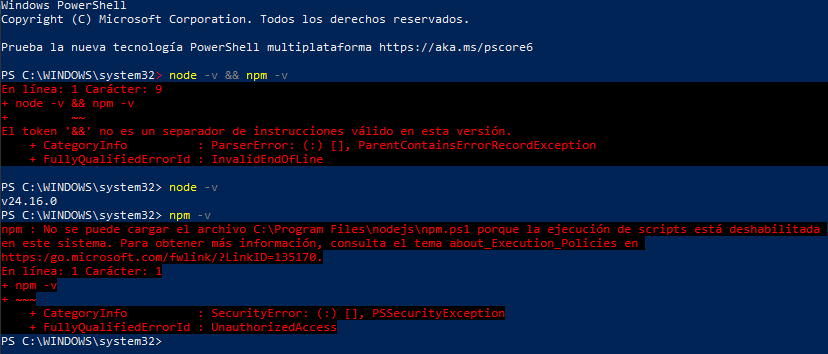
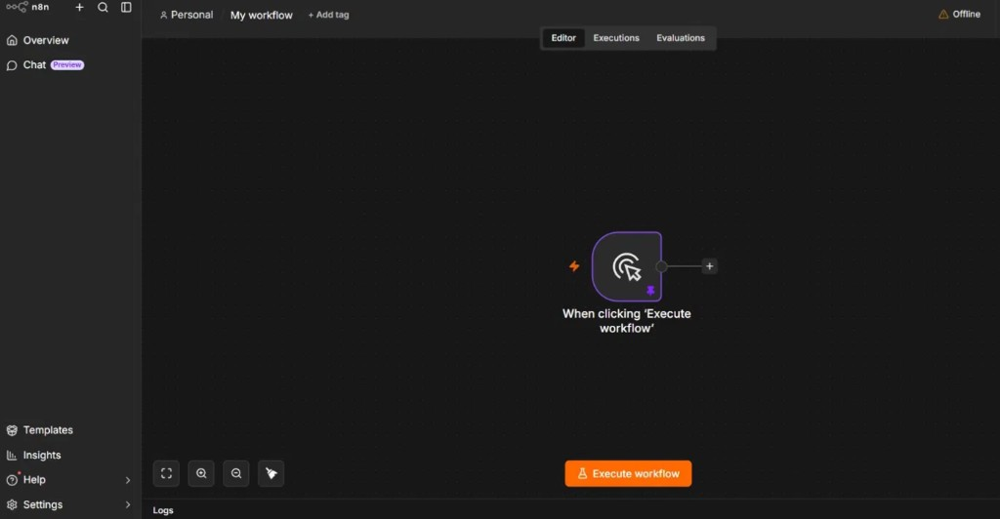
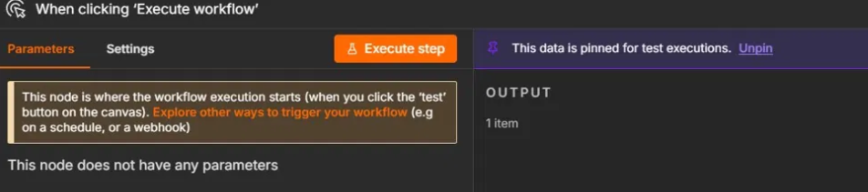
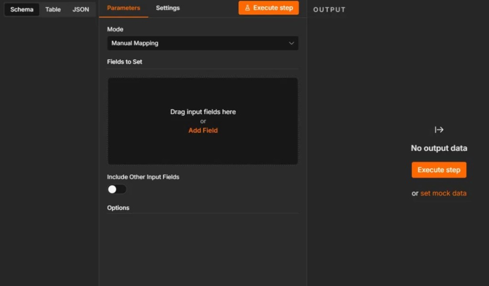
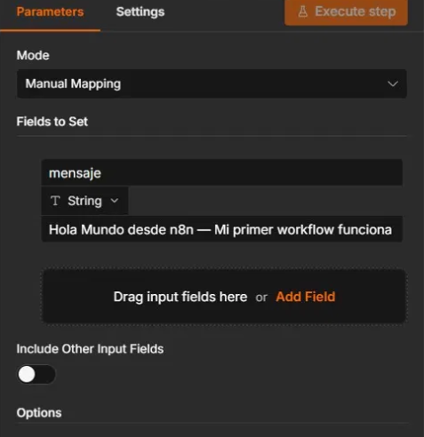
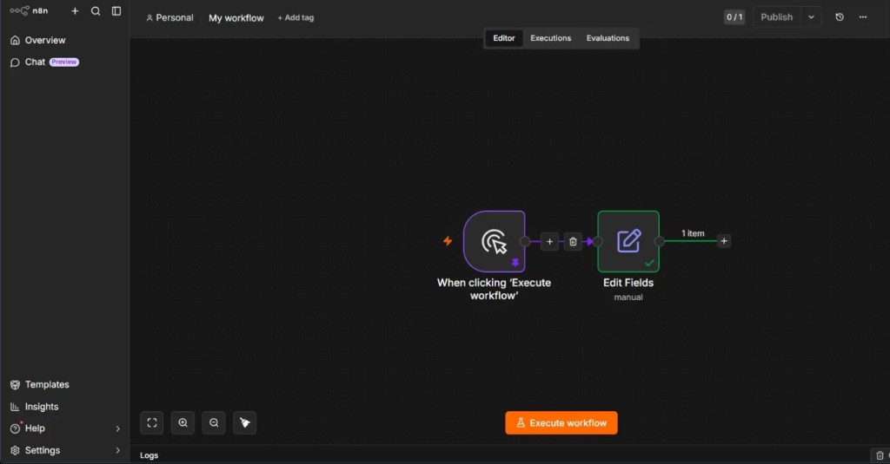
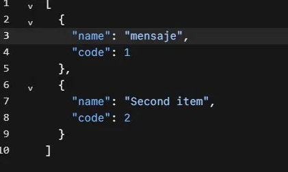
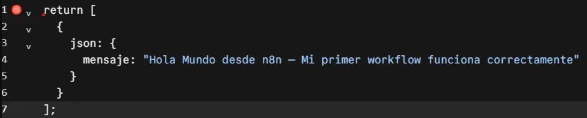

# Actividad Práctica — Instalación de n8n y Primer "Hola Mundo"

## Integrantes
- Nombre del estudiante: Camilo Andres Garcia Almeida
- Curso/Sección: Z1
- Fecha: `27/05/2026`

## Método de instalación utilizado
- Opción seleccionada: **n8n Local (Node.js + npm)**.
- Motivo: permite aprender la configuración base de n8n sin depender de servicios externos y con control total del entorno.

## Requisitos previos
- Sistema operativo: `Windows 10`.
- PowerShell disponible.
- Node.js instalado.
- npm instalado.

### Versiones verificadas
- `node -v` -> `v24.6.0`
- `npm -v` -> versión consultada en PowerShell (se identificó bloqueo de políticas de ejecución antes de usarlo correctamente).

## Proceso de instalación

### 1) Verificación inicial de Node.js y npm
Se verificó la instalación de Node.js y npm desde PowerShell.

Comandos utilizados:
```powershell
node -v
npm -v
```

### 2) Problema detectado con npm en PowerShell
Al ejecutar `npm -v` se presentó un error de seguridad por políticas de ejecución de scripts:



### 3) Solución aplicada
Se ajustó la política de ejecución para el usuario actual y se reintentó el comando:

```powershell
Set-ExecutionPolicy -Scope CurrentUser RemoteSigned
npm -v
```

Con esto se habilitó la ejecución de scripts locales firmados/no firmados en el perfil del usuario, resolviendo el bloqueo de `npm.ps1`.

### 4) Ejecución de n8n
Con Node.js y npm funcionando, se ejecutó n8n en modo local:

```powershell
npx n8n
```

Luego se abrió el panel web en:
- `http://localhost:5678`

## Problemas encontrados
1. **Error de sintaxis en PowerShell** al intentar correr dos comandos con `&&` (token no válido).
   - Solución: ejecutar cada comando por separado en PowerShell.
2. **Bloqueo de scripts de npm** por política de ejecución (`PSSecurityException`).
   - Solución: usar `Set-ExecutionPolicy -Scope CurrentUser RemoteSigned`.
3. **Ajuste del nodo para el mensaje final**.
   - Solución: configurar correctamente el nodo de salida (`Edit Fields` o `Code`) para devolver el campo `mensaje`.

## Workflow "Hola Mundo"
El flujo creado contiene:
1. **Manual Trigger** (`When clicking 'Execute workflow'`)
2. **Edit Fields** (configurado manualmente para generar el texto de salida)

Mensaje usado:
- `"Hola Mundo desde n8n — Mi primer workflow funciona correctamente"`

### Evidencia del armado del flujo

Panel principal de n8n:



Nodo de inicio (Manual Trigger):



Configuración inicial del nodo de edición:



Configuración del campo `mensaje`:



Workflow final conectado y listo:



### Evidencia alternativa (uso de nodo Code / salida JSON)
Durante las pruebas también se observó la construcción de salida tipo JSON:



Código de ejemplo para retornar el mensaje:



## Explicación de cada nodo utilizado
- **Manual Trigger**: inicia el flujo manualmente al presionar `Execute workflow`. Es ideal para pruebas y desarrollo inicial.
- **Edit Fields**: construye el objeto de salida, en este caso agregando el campo `mensaje` con el texto de "Hola Mundo".
- **(Opcional) Code**: permite devolver estructuras personalizadas en JavaScript, útil cuando se requiere lógica adicional.

## Evidencias
Todas las capturas usadas en esta documentación están almacenadas en:
- `capturas/`

Archivos incluidos:
- `capturas/01-error-npm-policy.png`
- `capturas/02-json-ejemplo.png`
- `capturas/03-code-node-hola-mundo.png`
- `capturas/04-trigger-ejecucion.png`
- `capturas/05-dashboard-n8n.png`
- `capturas/06-edit-fields-vacio.png`
- `capturas/07-edit-fields-mensaje.png`
- `capturas/08-workflow-final.png`

## Reflexión técnica final
1. **¿Qué fue lo más difícil de la instalación?**  
   Configurar correctamente PowerShell para permitir la ejecución de scripts de npm sin errores de seguridad.

2. **¿Qué ventajas tiene n8n?**  
   Es visual, flexible, rápido para prototipar automatizaciones y permite combinar muchos servicios en un mismo flujo.

3. **¿Qué diferencia encontraron entre Docker y local?**  
   Local es más rápido para empezar en aprendizaje. Docker ofrece mayor portabilidad y un entorno más parecido a producción.

4. **¿Para qué casos reales usarían automatización?**  
   Integración de formularios con hojas de cálculo, envío automático de correos, notificaciones de eventos y sincronización entre aplicaciones.

5. **¿Qué les gustaría automatizar en el futuro?**  
   Un flujo que reciba registros de formularios, los clasifique automáticamente y notifique resultados por correo o mensajería.

## Conclusión
Se logró instalar y ejecutar n8n de forma funcional en entorno local, crear el workflow "Hola Mundo", ejecutar el flujo con éxito y documentar el proceso completo con evidencia visual y análisis técnico.
